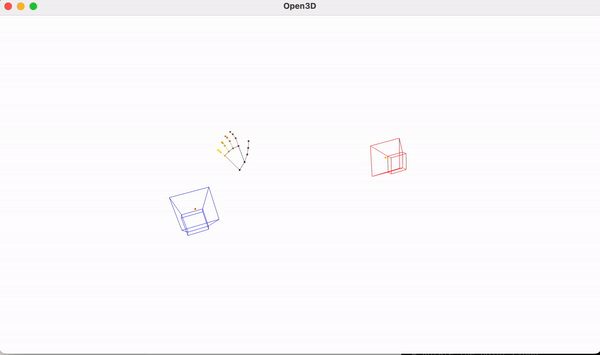

### Stereo Hand landmarker

Utilizes Stereo cameras to dectect handland marks and render in 3D space.



## Setting up

### Docker
Install [Docker](https://www.docker.com/). 

### Installing dependancies

We can install dependacies using conda. 

```
conda env create  -f env.yml
```

```
conda activate <env-name>
```

## Importing Calibration

Add the extrinsics and intrinsics directories to the root of this directory. Rename them to `camera_intrinsics` and `camera_extrinsics`

## Starting Application

First start Redis using `docker compose up`. Make sure you are in the project directory on the terminal. 

```
docker compose up -d
```

This will start the redis container in the background. 

Run 
```
python -m app.appv2
```
